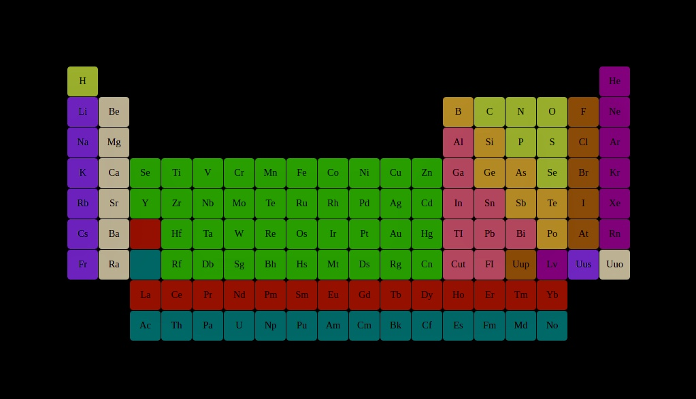

## Periodic table

exercise during my one year web development course to practice the nth-child selector.

**Build with:**  

<code></code>
<code></code>

[Live Demo] (https://mandyneumeyer.github.io/periodic_table/)

